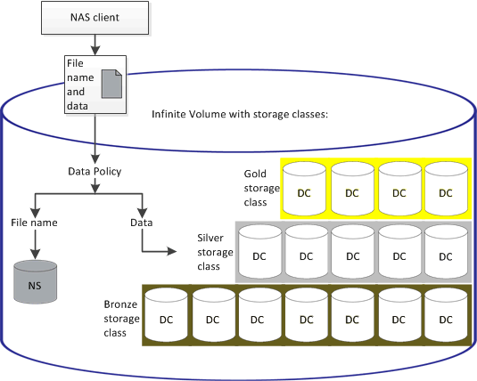

= 数据策略如何筛选写入无限卷的数据
:allow-uri-read: 
:icons: font
:imagesdir: ../media/

[role="lead"]
数据策略会自动将写入无限卷的数据筛选为不同的存储类。所有文件都会写入无限卷命名空间中的单个文件系统、而数据策略中的规则会确定存储文件数据的存储类。

创建无限卷时、系统会自动为带有无限卷的Storage Virtual Machine (SVM)创建默认数据策略。数据策略处于活动状态、并包含一个默认规则。对于具有和不具有存储类的无限卷、默认规则将按如下所示存储文件的传入数据：

|===
| 对于无限卷... | 默认数据策略执行此操作... 

 a| 
无存储类
 a| 
将文件的所有传入数据置于无限卷中

 a| 
一个存储类
 a| 
将文件的所有传入数据置于存储类中

 a| 
具有一个或多个存储类
 a| 
将文件的所有传入数据置于创建的第一个存储类中

|===
[NOTE]
====
对于具有两个或更多存储类的无限卷、您应尽快修改数据策略以创建规则、将不同类型文件的数据筛选到不同的存储类中。您应使用Unified Manager修改数据策略。

====
数据策略不会影响文件在无限卷命名空间中的文件系统位置、存储类对客户端应用程序是透明的。命名空间中的文件系统包含文件名。数据策略仅影响用于存储文件数据的存储类。在为无限卷分配两个或更多存储类时、数据策略非常有用。

您可以修改数据策略以创建其他规则、但不能删除数据策略或其默认规则。

下图说明了数据策略如何筛选无限卷的数据。文件名存储在命名空间成分卷中、数据策略中的规则指定此特定文件的数据存储在银牌存储类中。

