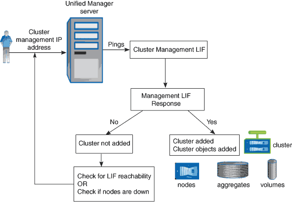

= 发现过程的工作原理
:allow-uri-read: 
:icons: font
:imagesdir: ../media/

[role="lead"]
将集群添加到 Unified Manager 后，服务器将发现集群对象并将其添加到数据库中。了解发现过程的工作原理有助于您管理组织的集群及其对象。

默认监控间隔为 15 分钟：如果已将集群添加到 Unified Manager 服务器，则需要 15 分钟才能在 Unified Manager UI 中显示集群详细信息。

下图显示了OnCommand Unified Manager中的发现过程：

