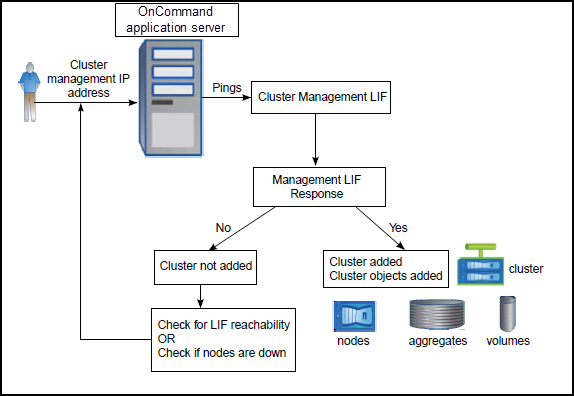

= 集群发现过程的工作原理
:allow-uri-read: 
:icons: font
:imagesdir: ../media/

[role="lead"]
将集群添加到 Unified Manager 后，服务器将发现集群对象并将其添加到数据库中。了解发现过程的工作原理有助于您管理组织的集群及其对象。

收集集群配置信息的监控间隔为 15 分钟。例如，添加集群后，需要 15 分钟才能在 Unified Manager UI 中显示集群对象。更改集群时，此时间范围也是如此。例如，如果向集群中的 SVM 添加两个新卷，则在下一轮询间隔之后，用户界面中会显示这些新对象，最长可能为 15 分钟。

下图显示了发现过程：

发现新集群的所有对象后， Unified Manager 将开始收集过去 15 天的历史性能数据。这些统计信息是使用数据连续性收集功能收集的。添加集群后，此功能会立即为您提供超过两周的集群性能信息。数据连续性收集周期完成后，系统会默认每五分钟收集一次实时集群性能数据。

[NOTE]
====
由于收集 15 天的性能数据需要占用大量 CPU 资源，因此建议您错开添加新集群的时间，以便不会在太多集群上同时运行数据连续性收集轮询。

====