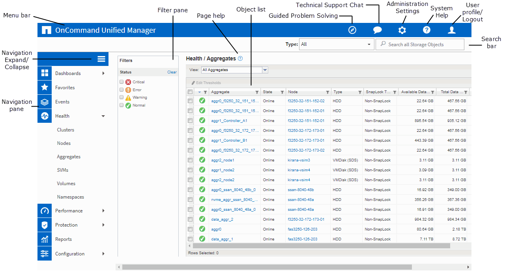

= 典型窗口布局
:allow-uri-read: 
:icons: font
:imagesdir: ../media/

[role="lead"]
了解典型的窗口布局有助于您有效地导航和使用OnCommand Unified Manager。大多数 Unified Manager 窗口都类似于两种常规布局之一：对象列表或详细信息。建议的显示设置至少为 1280 x 1024 像素。

并非每个窗口都包含下图中的每个元素。

== 对象列表窗口布局

== 对象详细信息窗口布局

image::../media/object-details.gif[对象详细信息]
