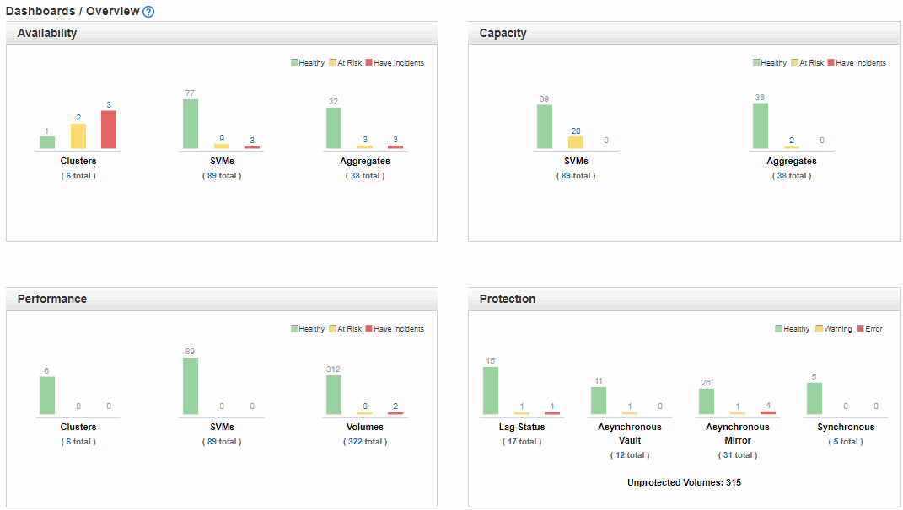

= 了解运行状况概述信息板
:allow-uri-read: 
:icons: font
:imagesdir: ../media/

[role="lead"]
Unified Manager运行状况概述信息板可提供有关存储和虚拟化环境运行状况的累积概览信息。"信息板/概述"页面提供有关存储对象的运行状况信息、这些存储对象分为四个运行状况类别：存储对象的可用性、容量、性能和保护。

下图显示了Dashboards/Overview页面上显示的窗格：

== 运行状况概述区域

以图形方式显示有关集群、聚合和Storage Virtual Machine (SVM)等存储对象的运行状况以及保护关系的运行状况的信息。"信息板/概述"页面显示为以下类别生成的事件：

单击任何黄色或红色条形图上方的数字可显示事件清单页面、其中仅包含这些事件。单击任一图表下方的数字可显示仅包含这些对象的对象清单页面。

* * 可用性 *
+
显示有关Unified Manager监控的集群、SVM和聚合的可用性信息。根据生成的可用性相关事件、存储对象归类为"运行状况良好"、"存在风险"或"发生意外事件"。

* * 容量 *
+
显示有关Unified Manager监控的SVM和聚合的容量的信息。根据生成的容量相关事件、存储对象归类为"运行状况良好"、"存在风险"或"发生意外事件"。

* * 性能 *
+
显示有关Unified Manager监控的集群、SVM和卷的性能信息。根据生成的性能相关意外事件、存储对象归类为"运行状况良好"、"存在风险"或"发生意外事件"。

* * 保护 *
+
显示有关Unified Manager监控的保护关系的信息。根据生成的保护相关事件、保护关系将归类为"运行状况良好"、"警告"或"错误"。

