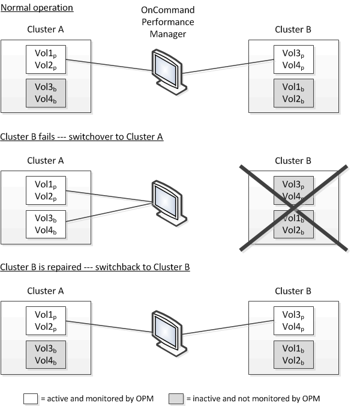

= 切换和切回期间的卷行为
:allow-uri-read: 
:icons: font
:imagesdir: ../media/

[role="lead"]
触发将发生原因活动卷从一个集群移动到灾难恢复组中另一个集群的切换或切回事件。集群上处于活动状态并向客户端提供数据的卷将停止，而另一集群上的卷将激活并开始提供数据。Unified Manager 仅监控处于活动状态且正在运行的卷。

由于卷会从一个集群移动到另一个集群，因此建议您监控这两个集群。Unified Manager 的一个实例可以监控 MetroCluster 配置中的两个集群，但有时两个位置之间的距离需要使用两个 Unified Manager 实例来监控这两个集群。下图显示了 Unified Manager 的一个实例：

名称中包含 p 的卷表示主卷，名称中包含 b 的卷是由 SnapMirror 创建的镜像备份卷。

在正常操作期间：

* 集群 A 具有两个活动卷： Vol1p 和 Vol2p 。
* 集群 B 具有两个活动卷： Vol3p 和 Vol4p 。
* 集群 A 具有两个非活动卷： Vol3b 和 Vol4b 。
* 集群 B 具有两个非活动卷： Vol1b 和 Vol2b 。

Unified Manager 将收集与每个活动卷相关的信息（统计信息，事件等）。Vol1p 和 Vol2p 统计信息由集群 A 收集， Vol3p 和 Vol4p 统计信息由集群 B 收集

发生灾难性故障导致活动卷从集群 B 切换到集群 A 后：

* 集群 A 具有四个活动卷： Vol1p ， Vol2p ， Vol3b 和 Vol4b 。
* 集群 B 具有四个非活动卷： Vol3p ， Vol4p ， Vol1b 和 Vol2b 。

在正常操作期间， Unified Manager 将收集与每个活动卷相关的信息。但在这种情况下， Vol1p 和 Vol2p 统计信息由集群 A 收集， Vol3b 和 Vol4b 统计信息也由集群 A 收集

请注意， Vol3p 和 Vol3b 不是相同的卷，因为它们位于不同的集群上。适用于 Vol3p 的 Unified Manager 中的信息与 Vol3b 不同：

* 在切换到集群 A 期间，不会显示 Vol3p 统计信息和事件。
* 在首次切换时， Vol3b 看起来像一个新卷，没有历史信息。

修复集群 B 并执行切回后， Vol3p 将在集群 B 上再次处于活动状态，并显示切换期间的历史统计信息和统计信息缺口。除非发生另一次切换，否则无法从集群 A 查看 Vol3b ：

image::../media/opm-mcc-volumes.gif[OPM MCC 卷]

[NOTE]
====
* 非活动的 MetroCluster 卷（例如，切回后集群 A 上的 Vol3b ）会通过消息 "`this volume was deleted` " 来标识。此卷并未实际删除，但 Unified Manager 当前不会监控此卷，因为它不是活动卷。
* 如果一个 Unified Manager 正在监控 MetroCluster 配置中的两个集群，则卷搜索将返回当时处于活动状态的任何卷的信息。例如，如果发生切换且 Vol3 在集群 A 上处于活动状态，则搜索 "`Vol3` " 将返回集群 A 上 Vol3b 的统计信息和事件

====