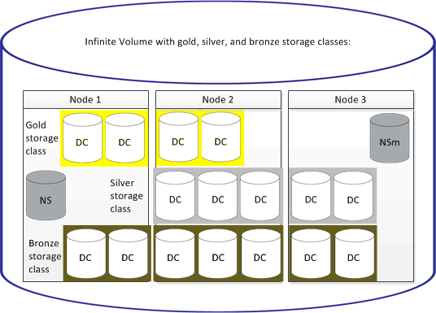

= 什么是存储类
:allow-uri-read: 
:icons: font
:imagesdir: ../media/

[role="lead"]
存储类是指聚合特征和卷设置的定义。您可以定义不同的存储类、并将一个或多个存储类与无限卷关联。您必须使用OnCommand Workflow Automation 为存储类要求定义工作流并将存储类分配给无限卷。

您可以为存储类定义以下特征：

* 聚合特征、例如要使用的磁盘类型
* 卷设置、例如数据压缩、重复数据删除和卷保证

例如、您可以定义一个存储类、该类仅使用具有SAS磁盘的聚合以及以下卷设置：启用了数据压缩和重复数据删除的精简配置。

下图显示了一个跨越多个节点并使用以下存储类的无限卷：黄金级、银级和铜牌级。每个存储类可以跨越无限卷中的两个或多个节点。此图还显示了数据成分卷在每个存储类中的放置位置。

