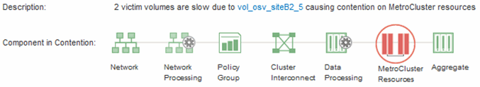

= 分析 MetroCluster 配置中集群上的动态性能事件
:allow-uri-read: 
:icons: font
:imagesdir: ../media/

[role="lead"]
您可以使用 Unified Manager 分析 MetroCluster 配置中检测到性能事件的集群。您可以确定所涉及的集群名称，事件检测时间以及 _bully" 和 _victim_ 工作负载。

== 开始之前

* 您必须具有操作员、OnCommand 管理员或存储管理员角色。
* 对于 MetroCluster 配置，必须存在新的，已确认的或已废弃的性能事件。
* MetroCluster 配置中的两个集群必须由同一个 Unified Manager 实例监控。

== 步骤

. 显示 * 事件详细信息 * 页面以查看有关事件的信息。
. 查看事件问题描述以查看涉及的工作负载的名称以及涉及的工作负载数量。
+
在此示例中， MetroCluster 资源图标为红色，表示 MetroCluster 资源处于争用状态。将光标置于图标上方可显示图标的问题描述。在事件ID页面顶部、集群名称用于标识检测到事件的集群的名称。

+

. 记下集群名称和事件检测时间，您可以使用这些名称和时间分析配对集群上的性能事件。
. 在图表中，查看 _victim_ 工作负载，确认其响应时间高于性能阈值。
+
在此示例中，受影响的工作负载显示在悬停文本中。延迟图表简要显示了相关受影响工作负载的一致延迟模式。即使受影响工作负载的异常延迟触发了事件，一致的延迟模式也可能表明工作负载的性能在其预期范围内，但 I/O 峰值增加了延迟并触发了事件。

+
image::../media/opm-mcc-incident-victim-workloads-png.gif[MetroCluster 配置的性能事件中受影响的工作负载]

+
如果您最近在访问这些卷工作负载的客户端上安装了一个应用程序，并且该应用程序向这些工作负载发送大量 I/O ，则您可能预计这些应用程序的延迟会增加。如果工作负载的延迟恢复到预期范围内，则事件状态将更改为已废弃，并保持此状态 30 分钟以上，您可能会忽略此事件。如果事件正在进行，并且仍处于新状态，您可以对其进行进一步调查，以确定事件是否由其他问题引起。

. 在工作负载吞吐量图表中，选择 * 大量工作负载 * 以显示抢占资源的工作负载。
+
存在抢占资源的工作负载表示此事件可能是由于本地集群上的一个或多个工作负载过度利用 MetroCluster 资源所致。抢占资源的工作负载在写入吞吐量(MBps)方面存在很大差异。

+
此图表简要显示了工作负载的写入吞吐量(MBps)模式。您可以查看写入MBps模式以确定异常吞吐量、这可能表明工作负载过度利用MetroCluster 资源。

+
如果事件中不涉及抢占资源的工作负载，则事件可能是由集群之间具有链路的运行状况问题描述或配对集群上的性能问题描述引起的。您可以使用 Unified Manager 检查 MetroCluster 配置中两个集群的运行状况。您还可以使用 Unified Manager 检查和分析配对集群上的性能事件。

