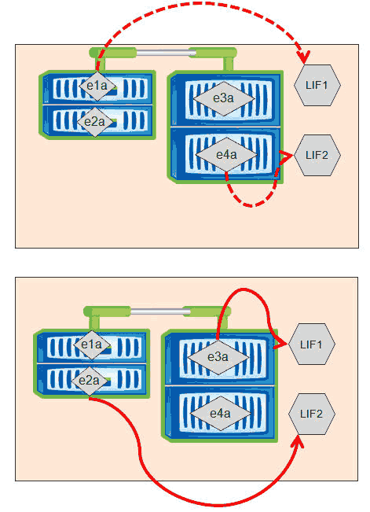
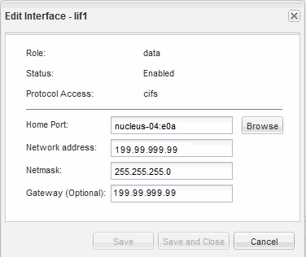

= 使用OnCommand 系统管理器更改LIF的主端口和节点
:allow-uri-read: 
:icons: font
:imagesdir: ../media/

[role="lead"]
您可以通过修改LIF的主端口和主节点来更改LIF的首选位置。这种配置比迁移LIF更持久、LIF通常用于在计划维护期间将LIF临时重新定位到其他节点。

== 关于此任务

下图显示了更改后的原始LIF主端口和节点以及主端口和节点。原始LIF1主端口已从e1a更改为e3a、LIF2已从E4A更改为E2A。

== 步骤

. 打开OnCommand 系统管理器。
. 在*主页*选项卡中、双击存储系统。
. 在导航窗格中、展开* SVM*层次结构。
. 在导航窗格中、选择SVM、然后单击*配置*>*网络接口*。
. 选择LIF并单击*编辑*。
. 在"*编辑接口"*对话框中、输入目标端口的主端口和网络地址。
+

+
[NOTE]
====
在ONTAP 8.2.1中、主端口字段处于禁用状态。

====
. 单击 * 保存并关闭 * 。

