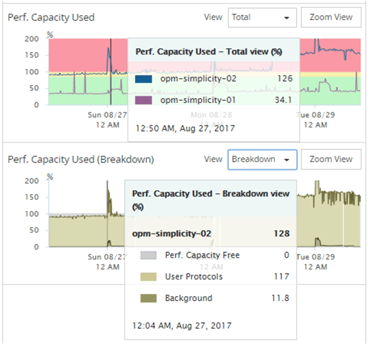

= 查看性能容量计数器图表以确定问题
:allow-uri-read: 
:icons: font
:imagesdir: ../media/

[role="lead"]
您可以在性能资源管理器页面上查看节点和聚合的已用性能容量图表。这样，您可以查看特定时间范围内选定节点和聚合的详细性能容量数据。

== 关于此任务

标准计数器图表显示选定节点或聚合的已用性能容量值。细分计数器图表显示根对象的总性能容量值，这些容量值根据用户协议与后台系统进程按使用情况进行细分。此外，还会显示可用性能容量。

[NOTE]
====
由于与系统和数据管理相关的某些后台活动被标识为用户工作负载并归类为用户协议，因此在运行这些进程时，用户协议百分比可能会人为地显示为较高。这些进程通常在集群使用率较低的午夜左右运行。如果您在午夜前后看到用户协议活动峰值，请验证集群备份作业或其他后台活动是否配置为在该时间运行。

====

== 步骤

. 从节点或聚合 * 登录 * 页面中选择 * 资源管理器 * 选项卡。
. 在 * 计数器图表 * 窗格中，单击 * 选择图表 * ，然后选择 * 性能已用容量 * 图表。
. 向下滚动，直到可以查看图表。
+
标准图表的颜色显示对象何时处于最佳范围（黄色），何时未充分利用（绿色）以及何时过度利用（红色）。细分图表仅显示根对象的详细性能容量详细信息。

+

. 如果要以完整大小格式查看任一图表，请单击 * 缩放视图 * 。
+
通过这种方式，您可以在单独的窗口中打开多个计数器图表，以便将已用性能容量值与同一时间范围内的 IOPS 或 MBps 值进行比较。

