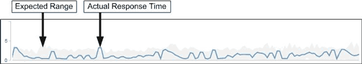

= Unified Manager 如何使用工作负载延迟来确定性能问题
:allow-uri-read: 
:icons: font
:imagesdir: ../media/

[role="lead"]
工作负载延迟（响应时间）是指集群上的卷响应客户端应用程序的 I/O 请求所需的时间。Unified Manager 会使用延迟检测性能事件并向您发出警报。

高延迟意味着从应用程序向集群上的卷发出的请求所需时间比平常要长。由于一个或多个集群组件上发生资源争用，高延迟的发生原因可能位于集群本身上。集群外部的问题也可能导致高延迟，例如网络瓶颈，托管应用程序的客户端问题或应用程序本身的问题。

[NOTE]
====
Unified Manager 仅监控集群上的工作负载活动。它不会监控应用程序，客户端或应用程序与集群之间的路径。

====
集群上的操作（例如创建备份或运行重复数据删除）会增加对其他工作负载共享的集群组件的需求，这也会导致高延迟。如果实际延迟超过预期范围的性能阈值、则Unified Manager将分析此事件以确定它是否为可能需要解决的性能事件。延迟以每操作毫秒数（毫秒 / 操作）为单位。

在"性能/卷详细信息"页面上、您可以查看延迟统计信息的分析、以查看读取和写入请求等单个进程的活动与整体延迟统计信息的比较情况。此比较可帮助您确定哪些操作的活动最多，或者特定操作是否存在影响卷延迟的异常活动。在分析性能事件时，您可以使用延迟统计信息来确定事件是否由集群上的问题描述引起。您还可以确定事件涉及的特定工作负载活动或集群组件。

此示例显示了"性能/卷详细信息"页面上的"延迟"图表。实际响应时间(延迟)活动为蓝线、预期范围为灰色。

[NOTE]
====
如果 Unified Manager 无法收集数据，蓝线可能会出现空隙。发生这种情况的原因可能是集群或卷无法访问， Unified Manager 在此期间关闭或收集所用时间超过 5 分钟收集时间段。

====