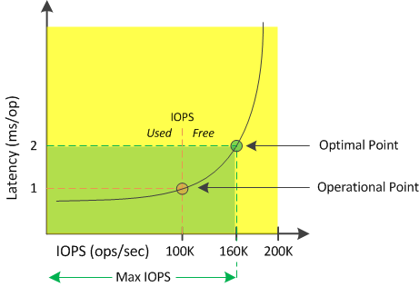

= 什么是可用 IOPS
:allow-uri-read: 
:icons: font
:imagesdir: ../media/

[role="lead"]
可用 IOPS 计数器用于确定在资源达到限制之前可添加到节点或聚合的剩余 IOPS 数量。节点可以提供的总 IOPS 取决于节点的物理特性，例如 CPU 数量， CPU 速度和 RAM 量。聚合可提供的总 IOPS 取决于磁盘的物理属性，例如 SATA ， SAS 或 SSD 磁盘。

可用性能容量计数器可提供仍可用资源的百分比，而可用 IOPS 计数器则可指示在达到最大性能容量之前可向资源添加的确切 IOPS （工作负载）数。

例如，如果您使用的是一对 FAS2520 和 FAS8060 存储系统，则可用性能容量值 30% 表示您有一些可用性能容量。但是，此值无法显示您可以向这些节点部署多少个工作负载。可用 IOPS 计数器可能会显示， FAS8060 上的可用 IOPS 为 500 ，而 FAS2520 上的可用 IOPS 为 100 。

[NOTE]
====
只有当集群中的节点安装了ONTAP 9.0或更高版本的软件时、才会显示可用的IOPS数据。

====
下图显示了节点的延迟与 IOPS 曲线示例。

资源可以提供的最大 IOPS 数是已用性能容量计数器为 100% （最佳点）时的 IOPS 数。此操作点表示节点当前以 100 ， 000 IOPS 运行，延迟为 1.0 毫秒 / 操作根据从节点捕获的统计信息， Unified Manager 会确定此节点的最大 IOPS 为 160 ， 000 ，这意味着可用或可用 IOPS 为 60 ， 000 。因此，您可以向此节点添加更多工作负载，以便更高效地使用系统。

[NOTE]
====
如果资源中的用户活动极少，则可用 IOPS 值将根据每个 CPU 核大约 4 ， 500 IOPS 计算得出，并假设使用通用工作负载。这是因为 Unified Manager 缺少数据来准确估计所服务工作负载的特征。

====