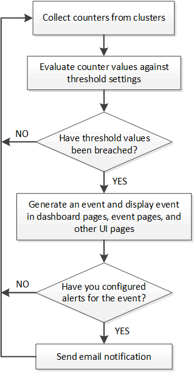

= 收到事件时会发生什么情况
:allow-uri-read: 
:icons: font
:imagesdir: ../media/

[role="lead"]
Unified Manager收到事件后、该事件将显示在Dashboards/Overview页面、Performance/Cluster页面的Summary和Explorer选项卡、Events清单页面以及对象特定的清单页面(例如、Health/Volumes清单页面)中。

如果 Unified Manager 检测到同一集群组件多次连续出现相同的事件条件，则会将所有发生的事件视为单个事件，而不是单独的事件。事件持续时间将递增，表示事件仍处于活动状态。

根据您在配置/警报页面中配置设置的方式、您可以向其他用户通知这些事件。此警报将启动以下操作：

* 可以向所有 Unified Manager 管理员用户发送有关此事件的电子邮件。
* 可以将此事件发送给其他电子邮件收件人。
* SNMP 陷阱可以发送到陷阱接收方。
* 可以执行自定义脚本以执行操作。

下图显示了此工作流。

