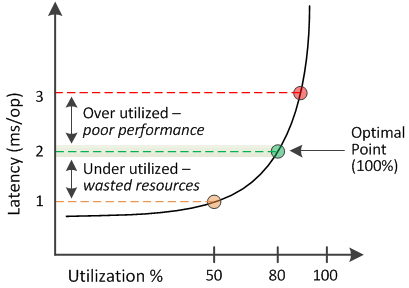

= 已用性能容量值的含义
:allow-uri-read: 
:icons: font
:imagesdir: ../media/

[role="lead"]
已用性能容量值可帮助您确定当前过度利用或未充分利用的节点和聚合。这样，您就可以重新分配工作负载，以提高存储资源的效率。

下图显示了资源的延迟与利用率曲线，并使用彩色点确定了当前运行点所在的三个区域。

* 已用性能容量百分比等于 100 表示处于最佳状态。
+
此时，资源得到了高效利用。

* 已用性能容量百分比大于 100 表示节点或聚合已过度利用，并且工作负载的性能未达到最佳。
+
不应向资源中添加任何新工作负载，并且可能需要重新分配现有工作负载。

* 已用性能容量百分比低于 100 表示节点或聚合未充分利用，并且资源未得到有效利用。
+
可以向资源添加更多工作负载。

[NOTE]
====
与利用率不同，已用性能容量百分比可以高于 100% 。没有最大百分比，但资源过度利用时，通常会处于 110% 到 140% 的范围内。较高的百分比表示资源存在严重问题。

====